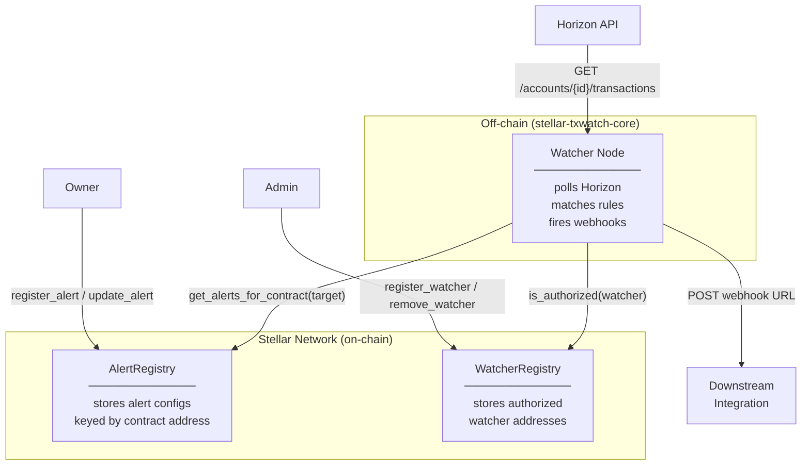

# stellar-txwatch-contracts

Soroban smart contracts for on-chain alert configuration storage and watcher registry.  
Part of the [Tx-wat](https://github.com/Tx-wat) organization.

## Contracts

| Contract | Description |
|---|---|
| [Alert Registry](contracts/alert-registry/src/lib.rs) | Stores alert configs on-chain keyed by contract address |
| [Watcher Registry](contracts/watcher-registry/src/lib.rs) | Stores authorized watcher node addresses |

## Quick Start

```bash
# Install Rust + Soroban target
curl --proto '=https' --tlsv1.2 -sSf https://sh.rustup.rs | sh
rustup target add wasm32-unknown-unknown

# Build
cargo build --release --target wasm32-unknown-unknown

# Test
cargo test

# Generate TypeScript bindings
make bindings
```

## TypeScript Bindings

TypeScript bindings for the AlertRegistry contract are available on npm:

```bash
npm install @tx-wat/alert-registry-bindings
```

See [bindings/alert-registry/README.md](bindings/alert-registry/README.md) for usage examples.

To generate bindings locally:

```bash
make bindings
```

## Architecture



**Data flow:**

1. An owner registers an alert in `AlertRegistry` — specifying the target contract, rules, and a hashed webhook URL.
2. Authorized watcher nodes are recorded in `WatcherRegistry` by an admin.
3. A watcher node polls Horizon for transaction activity, fetches matching alert configs from `AlertRegistry`, and checks whether any rule matches.
4. On a match the watcher fires the configured webhook so downstream integrations can react.

---

## How it works

The system is centered around three data-flow steps:

1. An owner registers an alert in `AlertRegistry` with the contract address, labels, webhook hash, and rules.
2. Authorized watcher nodes poll Horizon for transaction activity, then check the stored alert definitions in `AlertRegistry` to determine whether a watched contract event matches.
3. When a match is found, the watcher fires the configured webhook so downstream integrations can react.

This keeps alert configuration on-chain while letting watcher nodes perform off-chain polling and delivery.

## Stellar Integration

### Network Configuration

```toml
# Testnet
rpc_url       = "https://soroban-testnet.stellar.org"
passphrase    = "Test SDF Network ; September 2015"
horizon_url   = "https://horizon-testnet.stellar.org"

# Mainnet
rpc_url       = "https://mainnet.stellar.validationcloud.io/v1/<API_KEY>"
passphrase    = "Public Global Stellar Network ; September 2015"
horizon_url   = "https://horizon.stellar.org"
```

### Invoking Contracts (Stellar CLI)

```bash
# Register a watcher (admin only)
stellar contract invoke \
  --id <WATCHER_REGISTRY_CONTRACT_ID> \
  --source <ADMIN_IDENTITY> \
  --network testnet \
  -- register_watcher \
  --admin <ADMIN_ADDRESS> \
  --watcher <WATCHER_ADDRESS>

# Register an alert config
stellar contract invoke \
  --id <ALERT_REGISTRY_CONTRACT_ID> \
  --source <OWNER_IDENTITY> \
  --network testnet \
  -- register_alert \
  --owner <OWNER_ADDRESS> \
  --target_contract <WATCHED_CONTRACT_ADDRESS> \
  --label "My Alert" \
  --webhook_hash "<sha256-of-webhook-url>" \
  --rules '["rule:transfer","rule:mint"]'

# Query alerts for a contract
stellar contract invoke \
  --id <ALERT_REGISTRY_CONTRACT_ID> \
  --network testnet \
  -- get_alerts_for_contract \
  --target_contract <WATCHED_CONTRACT_ADDRESS>
```

### Invoking Contracts (JavaScript SDK)

```js
import {
  Contract,
  SorobanRpc,
  TransactionBuilder,
  Networks,
  BASE_FEE,
  nativeToScVal,
  Address,
} from "@stellar/stellar-sdk";

const server = new SorobanRpc.Server("https://soroban-testnet.stellar.org");
const contract = new Contract("<ALERT_REGISTRY_CONTRACT_ID>");

// Build a register_alert transaction
const account = await server.getAccount(ownerKeypair.publicKey());
const tx = new TransactionBuilder(account, {
  fee: BASE_FEE,
  networkPassphrase: Networks.TESTNET,
})
  .addOperation(
    contract.call(
      "register_alert",
      new Address(ownerKeypair.publicKey()).toScVal(),          // owner
      new Address("<WATCHED_CONTRACT_ADDRESS>").toScVal(),      // target_contract
      nativeToScVal("My Alert", { type: "string" }),            // label
      nativeToScVal("<sha256-of-webhook-url>", { type: "string" }), // webhook_hash
      nativeToScVal(["rule:transfer", "rule:mint"], { type: "array", element: { type: "string" } }), // rules
    )
  )
  .setTimeout(30)
  .build();

const preparedTx = await server.prepareTransaction(tx);
preparedTx.sign(ownerKeypair);
const result = await server.sendTransaction(preparedTx);
console.log("Transaction hash:", result.hash);
```

```js
import {
  Contract,
  SorobanRpc,
  TransactionBuilder,
  Networks,
  BASE_FEE,
  Address,
} from "@stellar/stellar-sdk";

const server = new SorobanRpc.Server("https://soroban-testnet.stellar.org");
const contract = new Contract("<WATCHER_REGISTRY_CONTRACT_ID>");

// Initialize the registry (one-time, admin only)
const account = await server.getAccount(adminKeypair.publicKey());
const initTx = new TransactionBuilder(account, {
  fee: BASE_FEE,
  networkPassphrase: Networks.TESTNET,
})
  .addOperation(
    contract.call(
      "initialize",
      new Address(adminKeypair.publicKey()).toScVal(), // admin
    )
  )
  .setTimeout(30)
  .build();

const preparedInit = await server.prepareTransaction(initTx);
preparedInit.sign(adminKeypair);
await server.sendTransaction(preparedInit);

// Register a watcher node (admin only)
const account2 = await server.getAccount(adminKeypair.publicKey());
const registerTx = new TransactionBuilder(account2, {
  fee: BASE_FEE,
  networkPassphrase: Networks.TESTNET,
})
  .addOperation(
    contract.call(
      "register_watcher",
      new Address(adminKeypair.publicKey()).toScVal(),   // admin
      new Address("<WATCHER_NODE_ADDRESS>").toScVal(),   // watcher
    )
  )
  .setTimeout(30)
  .build();

const preparedRegister = await server.prepareTransaction(registerTx);
preparedRegister.sign(adminKeypair);
await server.sendTransaction(preparedRegister);

// Check if an address is an authorized watcher (read-only, no signature needed)
const account3 = await server.getAccount(adminKeypair.publicKey());
const checkTx = new TransactionBuilder(account3, {
  fee: BASE_FEE,
  networkPassphrase: Networks.TESTNET,
})
  .addOperation(
    contract.call(
      "is_authorized",
      new Address("<WATCHER_NODE_ADDRESS>").toScVal(), // watcher
    )
  )
  .setTimeout(30)
  .build();

const result = await server.simulateTransaction(checkTx);
console.log("Is authorized:", result.result?.retval); // SCV_BOOL
```

### Invoking Contracts (Rust SDK)

```rust
use soroban_sdk::{Address, Env, String, Vec};

// In a cross-contract call context:
let alert_registry = AlertRegistryClient::new(&env, &alert_registry_id);
let config_id = alert_registry.register_alert(
    &owner,
    &target_contract,
    &String::from_str(&env, "My Alert"),
    &String::from_str(&env, "<webhook-hash>"),
    &rules,
);
```

> **Re-entrancy safety:** Soroban executes contract calls atomically and prevents classic callback-based re-entrancy within the same transaction. The registry contracts only mutate local storage after `require_auth()` succeeds, and they do not invoke external contracts during state updates.

### Auth Flow

All mutating functions require Stellar auth signatures:

```
Owner signs → register_alert / update_alert / remove_alert
Admin signs → register_watcher / remove_watcher / transfer_admin
```

Stellar's `require_auth()` enforces this at the protocol level — no custom signature verification needed.

### Event Indexing (planned)

Contracts emit no custom events yet. Watchers poll via Horizon's transaction endpoint:

```
GET https://horizon-testnet.stellar.org/accounts/<CONTRACT_ID>/transactions
```

Future versions will emit `soroban_sdk::events` for real-time indexing.

## TypeScript Bindings

TypeScript bindings for `WatcherRegistry` are published to npm and generated
automatically from the compiled WASM on every release using
`stellar contract bindings typescript`.

```bash
npm install @tx-wat/watcher-registry @stellar/stellar-sdk
```

```typescript
import { Client, networks } from "@tx-wat/watcher-registry";

const client = new Client({
  contractId: networks.testnet.contractId,
  networkPassphrase: networks.testnet.networkPassphrase,
  rpcUrl: networks.testnet.rpcUrl,
});

const authorized = await client.is_authorized({ watcher: "GABC...XYZ" });
console.log(authorized.result); // true | false
```

See [bindings/watcher-registry/README.md](bindings/watcher-registry/README.md)
for the full API reference and usage examples.

## Deployed Addresses

See [DEPLOYMENTS.md](DEPLOYMENTS.md).

## Docs

- [Alert Registry function reference](docs/alert-registry.md)
- [Watcher Registry function reference](docs/watcher-registry.md)
- [Ecosystem submission guide](docs/ecosystem-submission.md)

## Contributing

See [CONTRIBUTING.md](CONTRIBUTING.md).

## Sister Repos

- **Core engine:** https://github.com/Tx-wat/stellar-txwatch-core
- **Web dashboard:** https://github.com/Tx-wat/stellar-txwatch-web

## License

MIT
